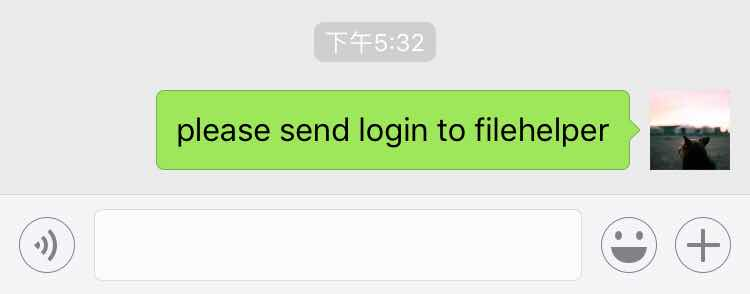
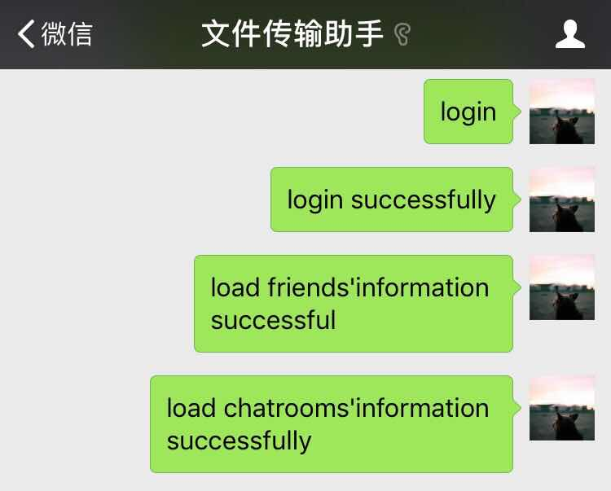
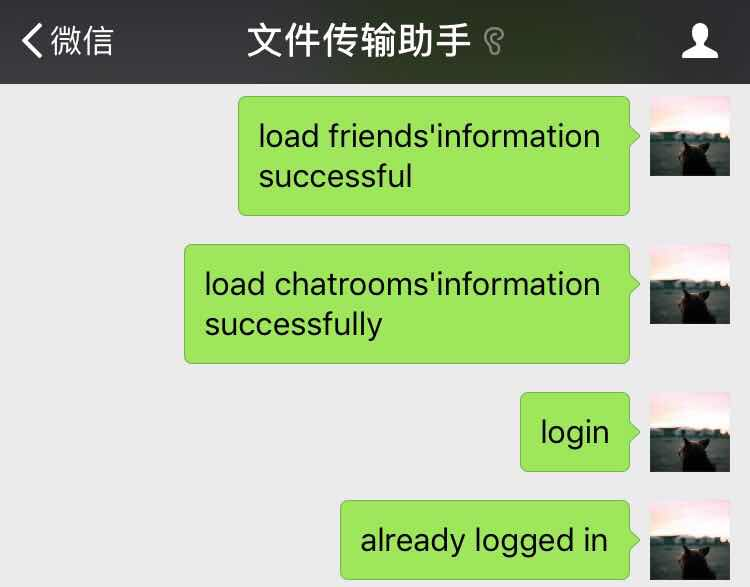

# CollectChatData
CollectChatData a python project collectting wechat messages with itchat module  
The data collectted can make up corpus for a chatBot  
# Show Result  

## 1.scan QRcode  

## 2.login

## 3.login again

